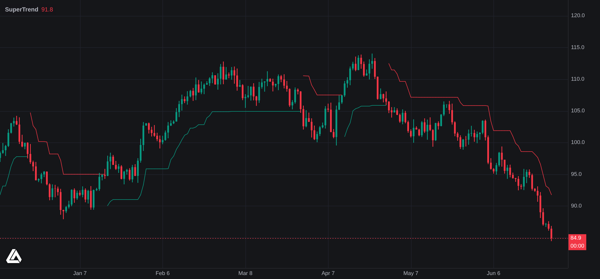

<picture>
  <source media="(prefers-color-scheme: dark)" srcset=".github/assets/banner-dark.svg">
  <source media="(prefers-color-scheme: light)" srcset=".github/assets/banner-light.svg">
  
</picture>

<div align="center">

<a href="https://cursor.com/en/install-mcp?name=luxalgo&config=eyJ1cmwiOiJodHRwczovL21jcC5sdXhhbGdvLmNvbS9tY3AifQ=="></a>&nbsp;<a href="https://vscode.dev/redirect/mcp/install?name=luxalgo&config=%7B%22type%22%3A%22http%22%2C%22url%22%3A%22https%3A%2F%2Fmcp.luxalgo.com%2Fmcp%22%7D"></a>

[](https://github.com/LuxAlgo/luxalgo-mcp-server/actions/workflows/ci.yml)
[](https://www.npmjs.com/package/@luxalgo/mcp)
[](LICENSE)

[Library](https://www.luxalgo.com/library/) · [Prop Firms](https://www.luxalgo.com/prop-firms/) · [Vela charts](#charts-in-your-browser-with-vela) · [npm](https://www.npmjs.com/package/@luxalgo/mcp) · [Endpoint](https://mcp.luxalgo.com/mcp)

</div>

**LuxAlgo MCP** is a LuxAlgo open-source project. Official repository: [github.com/LuxAlgo/luxalgo-mcp-server](https://github.com/LuxAlgo/luxalgo-mcp-server).

It puts the LuxAlgo ecosystem behind a single MCP server: an encyclopedia of trading and technical analysis, a live prop-firm directory, a Monte Carlo challenge simulator, and read-only access to your own brokerage accounts. Free and read-only. No API key for anything hosted; the local broker tools use your own keys and never send them anywhere.

```bash
claude mcp add --transport http luxalgo https://mcp.luxalgo.com/mcp
```

## What's inside

| Area | What you get |
| --- | --- |
| **[Library](https://www.luxalgo.com/library/)** | The encyclopedia of trading and technical analysis: hundreds of concept pages with formulas, the full indicator catalog with families and tags, and Pine Script sources where publicly served. |
| **Challenge Simulator** | The open-source [prop-firm-sim](https://github.com/LuxAlgo/prop-firm-sim) Monte Carlo engine, running locally inside the server. Your stats, or your real R-multiple trade series, through a firm's exact ruleset: pass probability with confidence intervals, expected attempts and cost, EV over the funded horizon, optimal-risk sweeps, cross-challenge comparison. Deterministic under seed, every assumption disclosed. |
| **Prop Firm Directory** | The live data the simulator draws from: firms, funded-account challenges with their full rulebooks (account sizes, fees, steps, profit splits, drawdown modes, trading restrictions), and current offers. |
| **Brokers** (local only) | Read-only access to your own accounts across 16 brokers and exchanges via [broker-sdk](https://github.com/LuxAlgo/broker-sdk): balances, positions, trade history, FIFO performance stats. Keys live in your MCP client config as env vars and never leave your machine. The hosted endpoint does not carry these tools, on purpose. |
| **Charts** (your browser) | Not a tool: the chart you draw with what the tools return. [Vela](https://github.com/LuxAlgo/Vela), LuxAlgo's open-source charting engine, runs the Pine Script that `library_get_source_code` hands back and paints the fills that `broker_trades` lists, in a browser tab, on your machine. [How the loop works](#charts-in-your-browser-with-vela). |

## Install

The hosted server is one URL:

```
https://mcp.luxalgo.com/mcp
```

### Claude Code

```bash
claude mcp add --transport http luxalgo https://mcp.luxalgo.com/mcp
```

### Cursor

Use the **Install in Cursor** button above, or add this to `.cursor/mcp.json`:

```json
{
  "mcpServers": {
    "luxalgo": {
      "url": "https://mcp.luxalgo.com/mcp"
    }
  }
}
```

### Any other MCP client

Point your client's MCP config at the hosted URL:

```json
{
  "mcpServers": {
    "luxalgo": {
      "url": "https://mcp.luxalgo.com/mcp"
    }
  }
}
```

<details>
<summary><b>Where each client keeps its config</b></summary>
<br>

| Client | Where to add it |
| --- | --- |
| Cursor | `.cursor/mcp.json`, or the install button above |
| Claude Desktop | `claude_desktop_config.json` |
| VS Code | Install button above, or MCP settings |
| Windsurf | `~/.codeium/windsurf/mcp_config.json` |
| Zed | `settings.json` under `context_servers` |
| Warp | Settings → Agents → MCP servers |
| LM Studio | `mcp.json` |
| OpenCode | `opencode.json` |
| Gemini CLI | `~/.gemini/settings.json` |

</details>

### Local (stdio)

Runs every hosted tool locally, and unlocks the broker tools. Set read-only credential env vars for the brokers you use. Any subset works: a broker connects when all of its vars are set, and with no vars at all the broker tools simply stay unconfigured.

```json
{
  "mcpServers": {
    "luxalgo": {
      "command": "npx",
      "args": ["-y", "@luxalgo/mcp"],
      "env": {
        "BROKERS_ALPACA_API_KEY": "…",
        "BROKERS_ALPACA_API_SECRET": "…",
        "BROKERS_KRAKEN_API_KEY": "…",
        "BROKERS_KRAKEN_API_SECRET": "…",
        "BROKERS_HYPERLIQUID_WALLET_ADDRESS": "0x…"
      }
    }
  }
}
```

Env var names derive from each broker's credential fields: `BROKERS_<BROKER>_<FIELD>` (for example `BROKERS_OKX_PASSPHRASE`, `BROKERS_IBKR_FLEX_FLEX_TOKEN`). The `broker_setup` tool lists every supported broker, its exact variables, and a one-line guide to creating each key with read-only scope, which is all this server ever needs.

## Tools

### Library

| Tool | Description |
| --- | --- |
| `library_search` | One search over concepts (alias-aware) and indicators |
| `library_get_concept` | Full concept page as markdown |
| `library_get_indicator` | Indicator detail: body, family, concepts, source code availability |
| `library_get_source_code` | Full source code when publicly served, fetched only on demand |
| `library_list_concepts` | Paginated concept roster, optionally per family |
| `library_list_indicators` | Filtered, paginated browse (family, concept, tags, platform, tier) with server-side sort |
| `library_list_tags` | The indicator tag vocabulary, for the tags filter |
| `library_list_families` | The taxonomy backbone with counts |
| `library_get_family` | A family hub as markdown plus concept roster |

Library outputs are compact JSON with canonical `url`s for citation. Concept and family pages are also directly fetchable as markdown: append `.md` to any concept URL.

### Prop Firms

The **challenge simulator**, running locally inside the server:

| Tool | Description |
| --- | --- |
| `propfirms_list_simulatable` | Every simulatable firm and challenge in the live directory, provenance-disclosed |
| `propfirms_challenge_rules` | One challenge's full encoded ruleset (drawdown modes, consistency, payout gating, citations), editable and re-simulatable inline |
| `propfirms_simulate` | Monte Carlo of your stats (win rate, avg win, trades/day, risk sizing) through a firm's exact ruleset and funded horizon: pass probability with CI, which rule kills attempts, expected attempts and cost, EV, payout probability |
| `propfirms_simulate_trades` | Same, from your real R-multiple trade series; block bootstrap preserves your streaks |
| `propfirms_optimal_risk` | Risk sweep: pass-optimal vs EV-optimal risk per trade (they differ) |
| `propfirms_compare` | Same trader across up to 12 challenges, EV-sorted (not a ranking) |
| `propfirms_pass_rates` | The site's reference-archetype odds, recomputed live (seed 42, 10k paths) |
| `propfirms_validate_strategy` | Screen one strategy across every simulatable challenge against an explicit pass bar |

Every simulation result carries its assumptions, unsimulated-rule flags, seed, and engine version. Results are distributions under stated assumptions, never promises. The engine runs locally; firm rules adapt live from the directory, and inline specs simulate fully offline.

The **directory** the simulator draws from, queryable directly:

| Tool | Description |
| --- | --- |
| `propfirms_search` | Search firms; firm filters (platforms, markets, payments, Trustpilot, country availability) compose with nested challenge and offer filters, and `include` nests matching children |
| `propfirms_get` | One firm's full dossier: profile, every challenge, live offers, written overview |
| `propfirms_search_challenges` | Search challenges by rules (size, fee, steps, profit split, drawdown, trading restrictions) and parent firm; can attach applicable live offers |
| `propfirms_search_offers` | Current discounts and promo codes, resolvable per firm or per challenge |

### Brokers (local stdio only)

| Tool | Description |
| --- | --- |
| `broker_setup` | Supported brokers, their env vars (set or unset, never values), read-only key guides |
| `broker_accounts` | Connected accounts: broker, currency, equity, cash |
| `broker_positions` | Open positions with market values, asset class, entry price; negative quantity means short |
| `broker_trades` | Trade history, newest first; filter by broker or symbol |
| `broker_stats` | Total equity, equity by broker, top positions, FIFO win rate and realized PnL |
| `broker_refresh` | Bypass the 5-minute cache and re-fetch now |

Read-only by construction: the SDK's root export has no trading endpoints, the server never writes secrets anywhere, and per-broker failures are reported alongside results, never silently dropped.

## Charts, in your browser, with Vela

Every tool above returns text and JSON. When the answer wants a chart, draw it with **[Vela](https://github.com/LuxAlgo/Vela)** (`@luxalgo/vela`, Apache-2.0), LuxAlgo's open-source charting engine: a headless chart with its own WebGL2 renderer that takes bars you already have, or fetches them from keyless public providers, and runs indicator scripts through pluggable engines. Pine Script lives in the [`@luxalgo/vela-pinets`](https://github.com/LuxAlgo/Vela-pinets) addon, which is what closes the loop with the Library: `library_get_source_code` hands an agent an indicator's exact Pine source, and Vela executes that source on a chart.

<picture>
  <source media="(prefers-color-scheme: dark)" srcset=".github/assets/vela-supertrend-dark.png">
  <source media="(prefers-color-scheme: light)" srcset=".github/assets/vela-supertrend-light.png">
  
</picture>

<sub>Not a mockup: the Library's <a href="https://www.luxalgo.com/library/indicator/supertrend/">SuperTrend</a> source as returned by <code>library_get_source_code</code>, executed by <code>@luxalgo/vela-pinets</code> on a <code>@luxalgo/vela</code> 0.6 chart and screenshotted in headless Chromium. The bars are a labelled synthetic sample; point <code>data</code> at your own or register a provider for live ones.</sub>

The whole demo is two script tags and five lines. `source` is the `source` field of a `library_get_source_code` result:

```html
<div id="chart" style="height: 480px"></div>
<script src="https://cdn.jsdelivr.net/npm/@luxalgo/vela@0.6.15/dist/vela.global.min.js"></script>
<script src="https://cdn.jsdelivr.net/npm/@luxalgo/vela-pinets@0.2.10/dist/vela-pinets.global.min.js"></script>
<script>
  const chart = new Vela.Vela('#chart', { data: bars, timeframe: '1D', theme: 'dark' }); // bars: [{ time, open, high, low, close, volume? }]
  chart.registerEngine('pine', new VelaPinets.PineEngine());
  chart.addIndicator(source);
</script>
```

With a bundler it is the same three calls over `import { Vela } from '@luxalgo/vela'` and `import { PineEngine } from '@luxalgo/vela-pinets'`; see Vela's [quickstart](https://github.com/LuxAlgo/Vela/blob/main/docs/user/quickstart.md). The same chart paints your own trades: [Trade Journal](https://github.com/LuxAlgo/trade-journal) takes the shape `broker_trades` returns and draws entries, exits and P&L labels through Vela's native-indicator API, engine-free, in [one component](https://github.com/LuxAlgo/trade-journal/blob/main/apps/web/src/components/trade-chart.tsx) you can lift as is.

**Where each piece runs.** This matters because it is the opposite of how the rest of this server works:

| Piece | Where | Notes |
| --- | --- | --- |
| Vela | A browser tab on your machine (Canvas 2D or WebGL2). | Never inside this server, hosted or stdio, and never in an MCP response. An agent gets the Pine source and the trades as text; the chart is what you build with them. |
| Bars | Yours, via `data`, or Vela's keyless Binance, Coinbase and Hyperliquid providers, fetched by the browser. | This server serves no market data, so a chart needs no LuxAlgo key and makes no LuxAlgo request. |
| Pine Script | `@luxalgo/vela-pinets`, which executes the [PineTS](https://github.com/LuxAlgo/PineTS) runtime. | AGPL-3.0, licensed separately from Vela's Apache-2.0 and this server's MIT. Vela itself ships no engine and carries no Pine code. |
| Attribution | Vela's mark, bottom-left of every chart. | Stays on unless you show equivalent attribution next to the chart; see Vela's [NOTICE](https://github.com/LuxAlgo/Vela/blob/main/NOTICE). |

Vela already draws the charts in [Trade Journal](https://github.com/LuxAlgo/trade-journal) and on the hosted [Market Trackers](https://www.luxalgo.com/market-trackers), and the [Vela page](https://www.luxalgo.com/vela) runs a live one.

## Development

```bash
npm install
npm run build
npm start            # stdio
npm run start:http   # streamable HTTP on :3333/mcp
npm test             # smoke suite over stdio (hits live endpoints)
npm run test:parity  # simulator tools vs upstream package + raw engine
```

Optional env: `LUXALGO_APP_ORIGIN` and `LUXALGO_SITE_ORIGIN` point the server at non-production environments.

## Disclaimer

Nothing this server returns is investment advice. Simulation outputs are modeled estimates under stated assumptions, not predictions or guarantees. Verify balances and performance numbers against your broker's own statements, and a prop firm's own page is authoritative for its current rules.

## License

Code is [MIT](LICENSE) © LuxAlgo Global, LLC. Library content and Pine Script sources served by this server keep their own licenses; see [NOTICE](NOTICE).

The LuxAlgo name and logo are trademarks of LuxAlgo Global, LLC; see [TRADEMARKS.md](TRADEMARKS.md). To report a vulnerability, see [SECURITY.md](SECURITY.md).
